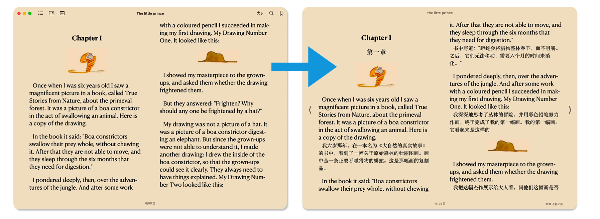
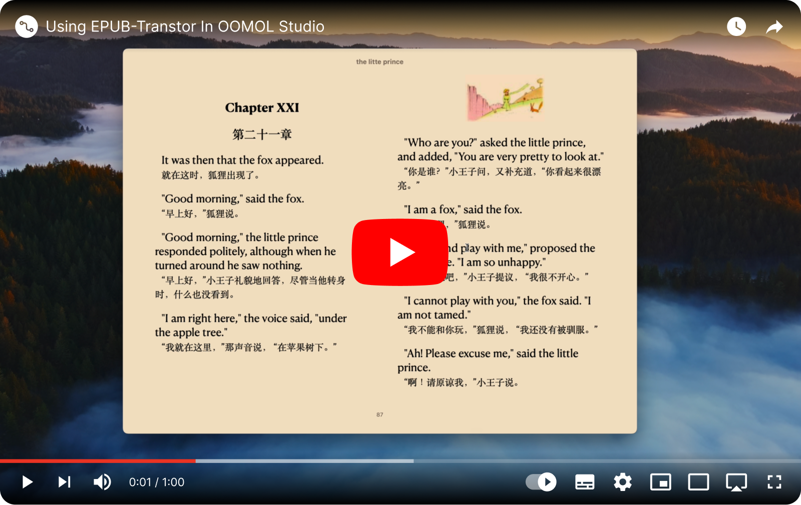

<div align=center>
  <h1>EPUB Translator</h1>
  <p>
    <a href="https://github.com/oomol-lab/epub-translator/actions/workflows/merge-build.yml" target="_blank"></a>
    <a href="https://pypi.org/project/epub-translator/" target="_blank"></a>
    <a href="https://pypi.org/project/epub-translator/" target="_blank"></a>
    <a href="https://pypi.org/project/epub-translator/" target="_blank"></a>
    <a href="https://github.com/oomol-lab/epub-translator/blob/main/LICENSE" target="_blank"></a>
  </p>
  <p><a href="https://hub.oomol.com/package/books-translator?open=true" target="_blank"></a></p>
  <p><a href="./README.md">English</a> | 中文</p>
</div>


使用大语言模型翻译 EPUB 电子书，同时保留原文。译文与原文并列显示，打造完美的双语阅读体验，特别适合语言学习和对照阅读。



## 特性

- **双语对照**: 保留原文并与译文并列显示，方便对照阅读
- **AI 驱动**: 利用大语言模型提供高质量、上下文感知的翻译
- **格式保留**: 完整保持 EPUB 结构、样式、图片和格式
- **全面翻译**: 翻译章节内容、目录和元数据
- **进度追踪**: 内置回调函数监控翻译进度
- **灵活的 LLM 支持**: 兼容任何 OpenAI 风格的 API 端点
- **缓存机制**: 内置缓存功能用于翻译失败后恢复进度

## 安装

```bash
pip install epub-translator
```

**系统要求**: Python 3.11、3.12 或 3.13

## 快速开始

### 使用 OOMOL Studio (推荐)

最简单的使用方式是通过 OOMOL Studio 的可视化界面:

[](https://www.youtube.com/watch?v=QsAdiskxfXI)

### 使用 Python API

```python
from epub_translator import LLM, translate, language, SubmitKind

# 使用 API 凭证初始化 LLM
llm = LLM(
    key="your-api-key",
    url="https://api.openai.com/v1",
    model="gpt-4",
    token_encoding="o200k_base",
)

# 使用语言常量翻译 EPUB 文件
translate(
    source_path="source.epub",
    target_path="translated.epub",
    target_language=language.CHINESE,
    submit=SubmitKind.APPEND_BLOCK,
    llm=llm,
)
```

### 带进度追踪

```python
from tqdm import tqdm

with tqdm(total=100, desc="翻译中", unit="%") as pbar:
    last_progress = 0.0

    def on_progress(progress: float):
        nonlocal last_progress
        increment = (progress - last_progress) * 100
        pbar.update(increment)
        last_progress = progress

    translate(
        source_path="source.epub",
        target_path="translated.epub",
        target_language="Chinese",
        submit=SubmitKind.APPEND_BLOCK,
        llm=llm,
        on_progress=on_progress,
    )
```

## API 参考

### `LLM` 类

初始化翻译所需的 LLM 客户端:

```python
LLM(
    key: str,                          # API 密钥
    url: str,                          # API 端点 URL
    model: str,                        # 模型名称 (例如 "gpt-4")
    token_encoding: str,               # Token 编码方式 (例如 "o200k_base")
    cache_path: PathLike | None = None,           # 缓存目录路径
    timeout: float | None = None,                  # 请求超时时间(秒)
    top_p: float | tuple[float, float] | None = None,
    temperature: float | tuple[float, float] | None = None,
    retry_times: int = 5,                         # 失败重试次数
    retry_interval_seconds: float = 6.0,          # 重试间隔(秒)
    log_dir_path: PathLike | None = None,         # 日志目录路径
)
```

### `translate` 函数

翻译 EPUB 文件:

```python
translate(
    source_path: PathLike | str,       # 源 EPUB 文件路径
    target_path: PathLike | str,       # 输出 EPUB 文件路径
    target_language: str,              # 目标语言 (例如 "Chinese", "English")
    submit: SubmitKind,                # 如何插入译文 (REPLACE, APPEND_TEXT, 或 APPEND_BLOCK)
    user_prompt: str | None = None,    # 自定义翻译指令
    max_retries: int = 5,              # 翻译失败的最大重试次数
    max_group_tokens: int = 1200,      # 每个翻译组的最大 token 数
    llm: LLM | None = None,            # 用于翻译和填充的单个 LLM 实例
    translation_llm: LLM | None = None,  # 翻译专用 LLM 实例（优先于 llm）
    fill_llm: LLM | None = None,       # XML 填充专用 LLM 实例（优先于 llm）
    on_progress: Callable[[float], None] | None = None,  # 进度回调函数 (0.0-1.0)
    on_fill_failed: Callable[[FillFailedEvent], None] | None = None,  # 错误回调函数
)
```

**注意**: 必须提供 `llm` 或同时提供 `translation_llm` 和 `fill_llm`。使用独立的 LLM 可以针对不同任务进行优化。

#### 提交模式

`submit` 参数控制译文如何插入到文档中。使用 `SubmitKind` 枚举类型指定插入模式：

```python
from epub_translator import SubmitKind

# 三种可用模式：
# - SubmitKind.REPLACE: 用译文替换原文（单语输出）
# - SubmitKind.APPEND_TEXT: 将译文作为内联文本附加（双语输出）
# - SubmitKind.APPEND_BLOCK: 将译文作为块级元素附加（双语输出，推荐）
```

**模式对比：**

- **`SubmitKind.REPLACE`**: 用译文替换原文，创建单语翻译版本。适用于只需要目标语言版本的场景。

- **`SubmitKind.APPEND_TEXT`**: 将译文作为内联文本紧接在原文后附加。两种语言出现在同一段落中，形成连续的阅读流。

- **`SubmitKind.APPEND_BLOCK`** (推荐): 将译文作为独立的块级元素（段落）附加在原文后。这在两种语言之间创建清晰的视觉分隔，最适合双语对照阅读。

**示例：**

```python
# 创建双语书籍（推荐）
translate(
    source_path="source.epub",
    target_path="translated.epub",
    target_language=language.CHINESE,
    submit=SubmitKind.APPEND_BLOCK,
    llm=llm,
)

# 创建单语翻译
translate(
    source_path="source.epub",
    target_path="translated.epub",
    target_language=language.CHINESE,
    submit=SubmitKind.REPLACE,
    llm=llm,
)
```

#### 语言常量

EPUB Translator 提供了预定义的语言常量供用户使用，您可以使用这些常量而不是直接编写语言名称字符串：

```python
from epub_translator import language

# 使用示例：
translate(
    source_path="source.epub",
    target_path="translated.epub",
    target_language=language.CHINESE,
    submit=SubmitKind.APPEND_BLOCK,
    llm=llm,
)

# 您也可以使用自定义的语言字符串：
translate(
    source_path="source.epub",
    target_path="translated.epub",
    target_language="Icelandic",  # 对于不在常量列表中的语言
    submit=SubmitKind.APPEND_BLOCK,
    llm=llm,
)
```

### 使用 `on_fill_failed` 处理错误

使用 `on_fill_failed` 回调监控翻译错误。系统会自动重试失败的翻译，最多重试 `max_retries` 次（默认：5 次）。大多数错误会在重试过程中恢复，不会影响最终输出。

```python
from epub_translator import FillFailedEvent

def handle_fill_error(event: FillFailedEvent):
    # 只记录会影响最终 EPUB 的关键错误
    if event.over_maximum_retries:
        print(f"关键错误（已尝试 {event.retried_count} 次）：")
        print(f"  {event.error_message}")
        print("  此错误将出现在最终的 EPUB 文件中！")

translate(
    source_path="source.epub",
    target_path="translated.epub",
    target_language=language.CHINESE,
    submit=SubmitKind.APPEND_BLOCK,
    llm=llm,
    on_fill_failed=handle_fill_error,
)
```

**理解错误严重程度：**

`FillFailedEvent` 包含：
- `error_message: str` - 错误描述
- `retried_count: int` - 当前重试次数（1 到 max_retries）
- `over_maximum_retries: bool` - 错误是否为关键错误

**错误分类：**

- **可恢复错误**（`over_maximum_retries=False`）：重试过程中发生的错误。系统会继续重试并可能自动解决这些问题。大多数情况下可以安全忽略。

- **关键错误**（`over_maximum_retries=True`）：所有重试尝试后仍然存在的错误。这些错误会出现在最终的 EPUB 文件中，需要进行调查。

**进阶用法：**

在翻译调试期间进行详细日志记录：

```python
def handle_fill_error(event: FillFailedEvent):
    if event.over_maximum_retries:
        # 关键错误：影响最终输出
        print(f"❌ 关键错误: {event.error_message}")
    else:
        # 信息提示：系统正在重试
        print(f"⚠️  第 {event.retried_count} 次重试: {event.error_message}")
```

### 双 LLM 架构

使用不同优化参数的独立 LLM 实例分别处理翻译和 XML 结构填充：

```python
# 创建两个具有不同温度参数的 LLM 实例
translation_llm = LLM(
    key="your-api-key",
    url="https://api.openai.com/v1",
    model="gpt-4",
    token_encoding="o200k_base",
    temperature=0.8,  # 较高温度用于创造性翻译
)

fill_llm = LLM(
    key="your-api-key",
    url="https://api.openai.com/v1",
    model="gpt-4",
    token_encoding="o200k_base",
    temperature=0.3,  # 较低温度用于结构保持
)

translate(
    source_path="source.epub",
    target_path="translated.epub",
    target_language=language.CHINESE,
    submit=SubmitKind.APPEND_BLOCK,
    translation_llm=translation_llm,
    fill_llm=fill_llm,
)
```

## 配置示例

### OpenAI

```python
llm = LLM(
    key="sk-...",
    url="https://api.openai.com/v1",
    model="gpt-4",
    token_encoding="o200k_base",
)
```

### Azure OpenAI

```python
llm = LLM(
    key="your-azure-key",
    url="https://your-resource.openai.azure.com/openai/deployments/your-deployment",
    model="gpt-4",
    token_encoding="o200k_base",
)
```

### 其他兼容 OpenAI 的服务

任何提供 OpenAI 兼容 API 的服务都可以使用:

```python
llm = LLM(
    key="your-api-key",
    url="https://your-service.com/v1",
    model="your-model",
    token_encoding="o200k_base",  # 匹配您模型的编码方式
)
```

## 使用场景

- **语言学习**: 阅读原版书籍的同时参考译文
- **学术研究**: 访问外文文献并获得双语参考
- **内容本地化**: 为国际读者准备书籍
- **跨文化阅读**: 在理解文化细微差别的同时欣赏文学作品

## 高级功能

### 自定义翻译提示词

提供特定的翻译指令:

```python
translate(
    source_path="source.epub",
    target_path="translated.epub",
    target_language="Chinese",
    submit=SubmitKind.APPEND_BLOCK,
    llm=llm,
    user_prompt="使用正式语言并保留专业术语",
)
```

### 缓存用于进度恢复

启用缓存以在翻译失败后恢复进度:

```python
llm = LLM(
    key="your-api-key",
    url="https://api.openai.com/v1",
    model="gpt-4",
    token_encoding="o200k_base",
    cache_path="./translation_cache",  # 翻译结果缓存在此
)
```

## 相关项目

### PDF Craft

[PDF Craft](https://github.com/oomol-lab/pdf-craft) 可以将 PDF 文件转换为 EPUB 等多种格式，专注于处理扫描版书籍。将 PDF Craft 与 EPUB Translator 结合使用，可以将扫描版 PDF 书籍转换并翻译成双语 EPUB 格式。

**工作流程**: 扫描版 PDF → [PDF Craft] → EPUB → [EPUB Translator] → 双语 EPUB

完整教程请观看: [将扫描版 PDF 书籍转换为 EPUB 格式并翻译成双语书](https://www.bilibili.com/video/BV1tMQZY5EYY/)

## 贡献

欢迎贡献! 请随时提交 Pull Request。

## 许可证

本项目采用 MIT 许可证 - 详见 [LICENSE](LICENSE) 文件

## 支持

- **问题反馈**: [GitHub Issues](https://github.com/oomol-lab/epub-translator/issues)
- **OOMOL Studio**: [在 OOMOL Studio 中打开](https://hub.oomol.com/package/books-translator?open=true)
